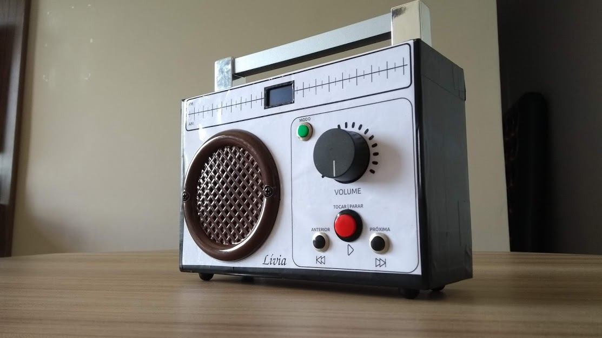

# Rádio Educativo

Radinho desenvolvido para presentear a minha sobrinha no natal

## Hardware

Baseado no Arduino Nano e DFplayer mini. Confira o Esquemático

## Montagem

Montado em uma caixa de papelão e acabamento com adesivo plastico

## Software

Desenvolvido com o framework Arduino no Plataformio

## Licença

MIT

## Autor 

Fábio Souza

