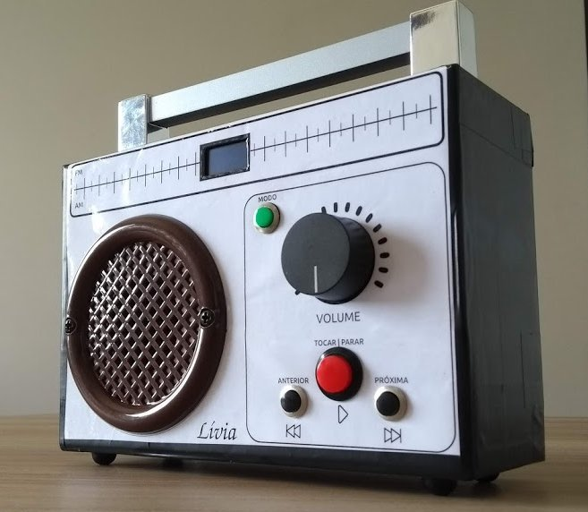

# Rádio Educativo

Radinho desenvolvido para presentear a minha sobrinha no natal.

Funcinamento:
- Musicas: Toca musicas da pasta 01 na sequência
- Histórias: Toca Histórias na pasta 02 - Uma por vez pois as historias são longas
- Jogo: Sorteia um som na Pasta 03 para que ela possa adivinhar. Pasta com sons diversos de curta duração( gato, cachorro, passsáro, buzina, etc)
- Hora de Dormir: toca musicas de ninar na sequência

Botões:
- Play
- Anterior
- Proximo
- Modo

Ajuste de volume e botão ligar no potênciômetro

Display OLED para exibir informações

Bateria: Power Bank

## Hardware

Baseado no Arduino Nano e DFplayer mini. Confira o Esquemático

## Montagem

Montado em uma caixa de papelão e acabamento com adesivo plastico

## Software

Desenvolvido com o framework Arduino no Plataformio

## Licença

MIT

## Autor 

Fábio Souza

